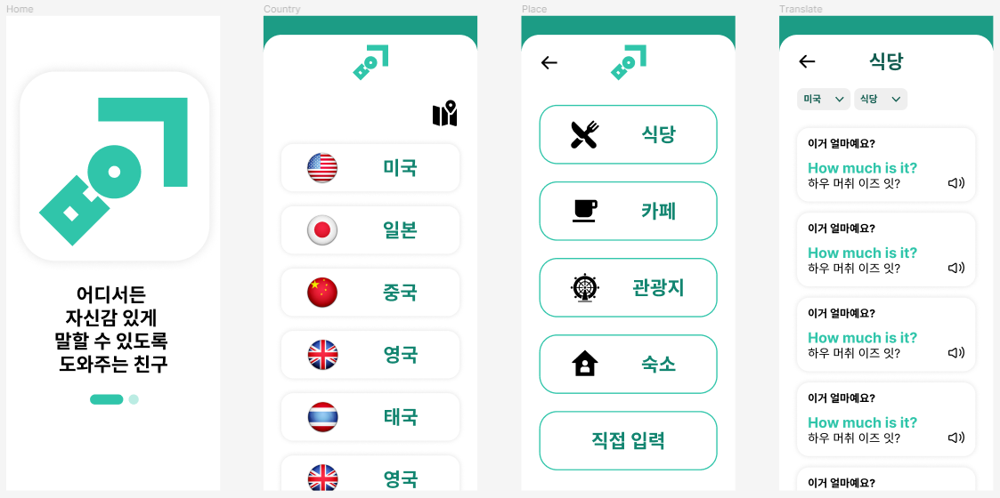
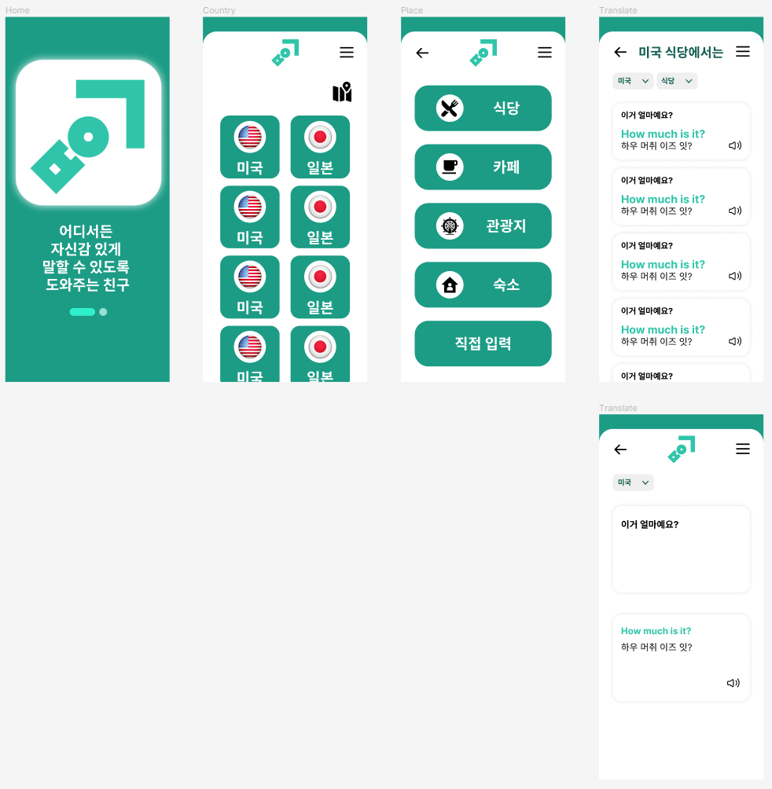
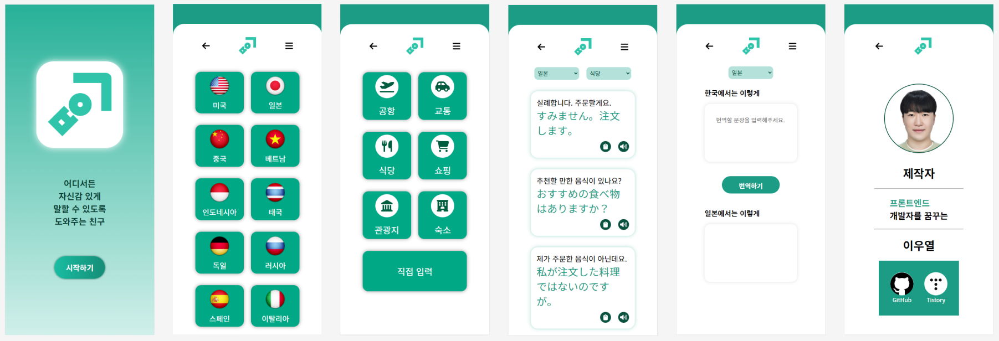

# ✈️ㅂㅇㄱ


> 번역기의 초성을 딴 **ㅂㅇㄱ**의 이름을 가진 번역기 앱
>
> 로고는 **ㅂㅇㄱ**를 대각선으로 배치하여 **화살표 모양**으로 <u>어려움을 겪어도 나아갈 방향을 제시한다는 의미</u>를 가짐

<br>

## ✅기획 의도

- 여행시 필수적인 문장들을 손 쉽게 확인할 수 있도록 하기 위해 제작

- 남녀노소 누구나 쉽게 접근 가능하기 때문에 해외에서 소통의 고민을 덜고자 제작
  - `ps) 부모님의 여행 걱정을 덜어드리고자 제작했음`

<br>

## ✅팀 구성

### 개인

<br>

## ✅사용 기술


### **Vue 2, Python, Figma**

<br>

- `Vue.js`를 통한 서버리스 프론트엔드 프로젝트
- 번역을 위한 `파파고 API` 사용
- Python을 통해 파파고 API로 기본적인 회화 문장들을 번역하여 JSON 파일로 저장 후 로드
- 자바스크립트를 사용한 `TTS(Text To Speach)` 사용

<br>

## ✅프로젝트 진행시 만난 오류

- [오류 정리 문서](./오류정리.md)

<br>

## ✅사용 방법

### 앱 사용

1. **시작하기** 버튼을 통해 번역기 사용을 시작
2. 여행할 **지역**을 선택
3. 여행할 지역에서 방문할 **장소(위치)**를 선택
4. 여행지에 맞는 언어로 번역된 여행지 방문 장소에서 **자주 사용되는 문장**들을 확인
   1. [자주 사용하는 문장 저장](./회화.md)

5. **편안한 관광**😊✈️

<br>

### 프로젝트 클론 후 사용

1. 프로젝트 setup

```bash
$ npm install
```

2. 프로젝트 실행

```bash
$ npm run serve
```

<br>

## ✅버전 기록

### 1.0.0v



- 초기 디자인
- 간단한 UI 디자인을 위해 누구나 알기 쉽게 제작
- 디자인 수정 필요

<br>

### 1.0.1v



- 디자인 수정
- `직접 입력` 페이지 디자인

<br>

### 2.0.0v



- 최종 디자인
- 처음 사용해도 편하게 알아 볼 수 있게 직관적인 UI를 사용
- `Vuex`를 통한 select tag의 값을 `store`에서 사용해 동적 데이터로 활용
- 직접 입력 페이지에서 `Papago API`를 통해 현재 선택된 나라의 언어로 실시간 번역


