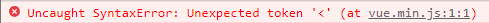

# ✅ 뷰

## 뷰 프로젝트 생성하기

```bash
$ vue create [프로젝트 이름]
```

<br>

## 뷰 컴포넌트 생성

> 컴포넌트 이름은 2개의 단어로 생성해야 함
>
> https://eslint.vuejs.org/rules/multi-word-component-names.html

```
// Bad
Home.vue

// Good
HomeComponent.vue
```

<br>

## 뷰 라우터(Vue2)

- 뷰 라우터 설치

- Vue2에서는 vue-router@3버전을 사용해야 함(4버전은 Vue3에서부터 사용 가능)

```bash
$ npm install --save vue-router@3
```

<br>

- 라우터 폴더 생성 -> index.js 파일 생성

```js
// src/router/index.js

import Vue from "vue";
import VueRouter from "vue-router";

import Home from "../views/HomeTap.vue";
import Country from "../views/SelectCountry.vue";

Vue.use(VueRouter);

const routes = [
  {
    path: "/",
    name: "home",
    component: Home,
  },
  {
    path: "/country",
    name: "country",
    component: Country,
  },
];

const router = new VueRouter({
  mode: "history",
  routes,
});

export default router;
```

<br>

- main.js에 라우터 등록

```js
import Vue from "vue";
import App from "./App.vue";
import router from "./router";

Vue.config.productionTip = false;

new Vue({
  router,
  render: (h) => h(App),
}).$mount("#app");
```

<br>

- App.vue에 라우터 링크와 라우터 뷰 추가

```vue
<template>
  <div id="app">
    <router-link to="/">Home</router-link>
    <router-link to="/country">country</router-link>

    <router-view></router-view>
  </div>
</template>

<script>
export default {
  name: "App",
  components: {},
};
</script>

<style></style>
```

<br>

## 뷰 컴포넌트 전환

- `<div>`와 같이 루트 태그가 존재해야 오류를 막을 수 있음

```vue
<template>
  <div>
    <h1>어디서든 자신감 있게 말할 수 있도록 도와주는 친구</h1>
    <router-link to="/country">시작하기</router-link>
  </div>
</template>

<script>
export default {
  name: "HomeTap",
};
</script>

<style scoped></style>
```

<br>

## 부모 컴포넌트에서 함수 전달받기

```vue
<template>
  <div id="app">
    <router-view
      v-on:selectCountry="selectCountry"
      v-on:selectPlace="selectPlace"
      v-bind:propsCountry="country"
      v-bind:propsPlace="place"
    >
    </router-view>
  </div>
</template>
```

- `v-on:selectCountry`는 자식 요소에서 사용하는 이벤트(`selectCountry`)를 전달받는다는 의미
- 이벤트를 전달받으면 부모 요소에서 정의된 `selectCountry` 메서드를 실행

<br>

## 뷰 데이터 넘기기(자식 -> 부모)

- 자식 컴포넌트에서 부모 컴포넌트의 데이터를 수정하기

```vue
<!-- CountryView.vue (자식 컴포넌트) -->
<template>
  <div>
    <HeadComponent></HeadComponent>
    <NavComponent></NavComponent>
    <div class="main">
      <div
        class="country__div"
        v-for="country in countries"
        v-bind:key="country"
        v-on:click="selectCountry($event)"
      >
        <p>{{ country }}</p>
      </div>
    </div>
  </div>
</template>

<script>
import HeadComponent from "@/components/HeadComponent.vue";
import NavComponent from "@/components/NavComponent.vue";

export default {
  name: "CountryView",
  props: ["propsCountry", "propsPlace"],
  data: () => ({
    countries: ["미국", "일본", "중국", "영국", "태국"],
  }),
  components: {
    HeadComponent,
    NavComponent,
  },
  methods: {
    selectCountry(event) {
      const text = event.target.innerText;
      console.log(text);
      this.$emit("selectCountry", text);
      this.$router.push("place");
    },
  },
};
</script>
```

- `v-on:click="selectCountry($event)"`인 디렉티브를 사용해 나라 선택 함수를 실행

- ```js
  selectCountry(event) {
    const text = event.target.innerText;
    console.log(text);
    this.$emit("selectCountry", text);
    this.$router.push("place");
  },
  ```

- 함수에서 보면 `$emit`을 사용하는데 이는 자식 컴포넌트에서 부모 컴포넌트로 데이터를 전달하는 방식

- 부모 컴포넌트의 `selectCountry` 함수 실행과 `text`를 전달

- 부모는 전달받은 함수를 부모 컴포넌트에서 실행

<br>

```vue
<!-- App.vue (부모 컴포넌트) -->
<template>
  <div id="app">
    <router-view
      v-on:selectCountry="selectCountry"
      v-on:selectPlace="selectPlace"
      v-bind:propsCountry="country"
      v-bind:propsPlace="place"
    >
    </router-view>
  </div>
</template>

<script>
export default {
  name: "App",
  data() {
    return {
      country: "",
      place: "",
    };
  },
  methods: {
    selectCountry(country) {
      this.country = country;
      localStorage.setItem("country", this.country);
      localStorage.removeItem("place");
      // console.log("현재 저장된 나라 " + this.country);
    },
    selectPlace(place) {
      this.place = place;
      localStorage.setItem("place", this.place);
      // console.log("현재 저장된 장소 " + this.place);
    },
  },
};
</script>
```

- 부모 컴포넌트에서는 자식 컴포넌트에서 전달 받은 `selectCountry` 함수를 실행함과 동시에 인자로 전달받은 `text`를 `country`라는 매개변수를 통해 현재 부모 요소에 저장된 데이터를 변경하는 코드를 실행

<br>

## 뷰 데이터 넘기기(부모 -> 자식)

- 부모 컴포넌트에서 자식 컴포넌트로 데이터를 넘겨야 하는 일이 생긴다.

```vue
<template>
  <div id="app">
    <router-view
      v-on:selectCountry="selectCountry"
      v-on:selectPlace="selectPlace"
      v-bind:propsCountry="country"
      v-bind:propsPlace="place"
    >
    </router-view>
    <!-- <p>{{ country }} | {{ place }}</p> -->
  </div>
</template>
```

- `v-bind:propsCountry="country"` 디렉티브를 통해 자식 컴포넌트에 `country` 데이터를 넘겨준다.

<br>

## 뷰 데이터 유지

```js
<!-- App.vue -->

methods: {
  selectCountry(country) {
    this.country = country;
    localStorage.setItem("country", this.country);
    // console.log("현재 저장된 나라 " + this.country);
  },
  selectPlace(place) {
    this.place = place;
    localStorage.setItem("place", this.place);
    // console.log("현재 저장된 장소 " + this.place);
  },
},
```

- 부모 컴포넌트에서 데이터를 저장할 때, 로컬 스토리지에도 동시에 저장을 해주면 유지 가능

<br>

```js
<!-- TranslateView.vue -->

created() {
  this.country = localStorage.getItem("country");
  this.place = localStorage.getItem("place");
},
```

- 자식 컴포넌트에서 데이터를 로컬스토리지에서 가져와 할당해주고 사용

<br>

### 🚨 로컬 스토리지 vs 세션 스토리지

#### 로컬스토리지(localStorage)

- 사용자 세션 데이터 유지 가능
- 브라우저 닫았다가 다시 열어도 유지 가능
- 탭을 여러 개 열어도 공유
- 삭제될 때까지 지속

<br>

#### 세션스토리지(sessionStorage)

- 브라우저 세션 기간 동안만 사용 가능
- 탭이나 창을 닫으면 삭제
- 새로 고침을 해도 유지
- 영원한 저장이 필요 없기 때문에 선택

<br>

### vuex-persistedstate (새로고침 유지)

- npm 설치

```bash
$ npm install --save vuex-persistedstate
```

<br>

- store.js 코드 추가
- paths를 적지 않으면 모든 store 값이 localstorage에 저장됨

```js
import createPersistedState from "vuex-persistedstate";

export const store = new Vuex.Store({
  plugins: [
    createPersistedState({
      paths: ["country", "place"],
    }),
  ],
  ...
});
```

<br>

- select 태그 만들기
- 이 때, 데이터 유지와 동적 데이터를 추적하기 위해 watch를 사용

```html
<select v-model="countrySelected">
  <option value="" hidden disabled>
    {{ getCountry }}
  </option>
  <option
    v-for="(key, country) in this.$store.state.countries"
    v-bind:key="country"
    v-bind:value="country"
  >
    {{ country }}
  </option>
</select>
```

- 기본으로 나타나는 값은 value를 주지 않고 hidden disable 속성을 통해 숨길 수 있음

<br>

## 액시오스

- axios 설치

```bash
$ npm install axios
```

<br>

- 오류가 너무 많이 뜬다....
- axios란 무엇인가?
- CORS란 무엇인가?
- API에서 CORS 오류 해결법
  - https://cors.sh/

- axios 비동기처리
  - https://developerjournal.tistory.com/8

<br>


## 뷰 props 스크립트에서 사용하기

- props를 data에서 사용하기 (computed)
  - https://kjwsx23.tistory.com/357

<br>

## Mixin

- Mixin은 여러 컴포넌트 간에 공통으로 사용되고 있는 로직, 기능들을 재사용하는 방법
  - https://m.blog.naver.com/pjok1122/221644073844

<br>

## Vuex

- props로 계속해서 전달해줘야 하는 복잡함을 vuex로 해결하기
- https://joshua1988.github.io/web-development/vuejs/vuex-start/

```bash
$ npm install vuex
```

<br>

### 🚨 vuex 설치 오류!

- Vue2는 Vuex3을, Vue3부터 Vuex4를 지원한다고 함

```bash
$ npm install vuex@3
```

<br>

```js
// store.js
import Vue from "vue";
import Vuex from "vuex";

Vue.use(Vuex);

export const store = new Vuex.Store({
  state: {
    counter: 0
  }
});
```

<br>

```js
// main.js
import Vue from "vue";
import App from "./App.vue";
// store.js를 불러오는 코드
import { store } from "./store";

new Vue({
  // 뷰 인스턴스의 store 속성에 연결
  store: store,
  render: h => h(App)
}).$mount("#app");
```

<br>

- state 접근 (부모, 자식 컴포넌트 모두 똑같이 접근 가능)

```vue
<template>
  <div id="app">
    {{ $store.state.counter }}
  </div>
</template>

<script>
  export default {
    // ...
      
    methods: {
      addCounter() {
        this.$store.state.counter++;
      },
      subCounter() {
        this.$store.state.counter--;
      }
    }
  }
</script>
```

<br>

## Vuex를 통해 동적 데이터 바인딩

- https://stackoverflow.com/questions/70696826/how-to-store-selected-value-in-vuex-store
- select 태그 값과 vuex에 저장된 값을 동기화하면서 양방향 데이터 바인딩 사용

<br>

## 뷰 로딩 컴포넌트 띄우기

- 엄청난 오류를 거쳐.. 겨우 성공..
- 대충 `SpinnerComponent.vue` 만들기

```vue
<template>
  <div class="lds-facebook">
    <div></div>
    <div></div>
    <div></div>
  </div>
</template>

<script>
export default {};
</script>

<style>
.lds-facebook {
  display: inline-block;
  position: absolute;
  width: 64px;
  height: 64px;
  top: 47%;
  left: 47%;
}
.lds-facebook div {
  display: inline-block;
  position: absolute;
  left: 6px;
  width: 13px;
  background: #42b883;
  animation: lds-facebook 1.2s cubic-bezier(0, 0.5, 0.5, 1) infinite;
}
.lds-facebook div:nth-child(1) {
  left: 6px;
  animation-delay: -0.24s;
}
.lds-facebook div:nth-child(2) {
  left: 26px;
  animation-delay: -0.12s;
}
.lds-facebook div:nth-child(3) {
  left: 45px;
  animation-delay: 0;
}
@keyframes lds-facebook {
  0% {
    top: 6px;
    height: 51px;
  }
  50%,
  100% {
    top: 19px;
    height: 26px;
  }
}
</style>
```

<br>

- `App.vue`에 등록

```vue
<template>
  <div id="app">
    <router-view
      v-on:selectCountry="selectCountry"
      v-on:selectPlace="selectPlace"
    >
    </router-view>
    <Spinner v-if="this.$store.state.loadingStatus"></Spinner>
  </div>
</template>

<script>
import Spinner from "@/components/SpinnerComponent.vue";

export default {
  name: "App",
  components: {
    Spinner,
  },
  // ...
};
</script>

<style scoped></style>
```

- 이 때, 스피너는 `this.$store.state.loadingStatus`가 `true`일 때만 보여짐

<br>

- `loadingStatus`를 상태 관리하기 위해 vuex에서 mutations으로 상태를 변경해줌

```js
export const store = new Vuex.Store({
  state: {
    // ...
    loadingStatus: false,
  },
  mutations: {
    startSpinner(state) {
      console.log("start");
      state.loadingStatus = true;
    },
    endSpinner(state) {
      console.log("end");
      state.loadingStatus = false;
    },
  },
});
```

<br>

- `this.$store.state.loadingStatus`의 값 변경은 axios로 API를 요청했을 때 `true`, 응답을 받았다면 `false`로 바꿔줌

```vue
<script>
// ...
    
export default {
  // ...
  methods: {
    async getData() {
      // ...

      try {
        this.$store.commit("startSpinner");

        await this.$axios
          .post("/papago/n2mt", params, config)
          .then((res) => {
            this.$store.commit("endSpinner");
            
            if (res.status == 200) {
              console.log(res.data.message.result.translatedText);
              this.result = res.data.message.result.translatedText;
            }
          })
          .catch((err) => {
            console.log("실패", err);
            this.$store.commit("endSpinner");
          });
      } catch (err) {
        console.log("실패", err);
        this.$store.commit("endSpinner");
      }
    },
  },
};
</script>
```

<br>

## 라우터 뒤로 가기

- 뭔가 router path 이런걸 이용해야 되는 줄 알았지만 간편한 방법이 있었다.

```vue
<template>
  <div class="nav">
    <div v-on:click="$router.go(-1)">
      <p>뒤로</p>
    </div>
    
    <div>
      <p>더보기</p>
    </div>
  </div>
</template>
```

- `$router.go(-1)`이라는 메서드가 존재했다.
- 갓 라우터..!

<br>

## 이미지 동적 데이터 바인딩

- `v-for` 안에서 키-값을 가지고 이미지 적용하기

```vue

```

- 동적 파일을 요구할 때, `require`을 사용해서 받을 수 있음
- 데이터 바인딩 필요
- 이미지 파일 이름은 서버에서 URL Encoding으로 변환하기 때문에 한글 대신 영어로 작성하는 것을 추천

- `store.js`에 저장된 나라 이름을 키-값을 가지는 딕셔너리로 수정

<br>

## 이벤트 발생 태그

- `<div>` 태그를 클릭했을 때 이벤트가 발생하도록 `v-on:click` 디텍티브를 걸어놓아도 실제 이벤트가 발생하는 것은 `<div>` 안에 있는 어떠한 무언가에서 발생하게 됨
- 이벤트 버블링 현상 때문
- 클릭 함수를 정의한 태그를 확인하기 위해서는 `event.target`이 아닌 `event.currentTarget`을 사용해야 함

```js
// div 태그 안 p 태그의 text를 가져오기 위한 셀렉트
const text = event.currentTarget.querySelector("p").innerText;
console.log(text);
```

<br>

## 이미지 로드

- 이미지 로딩이 느릴 경우 생성 주기를 통해 로딩 페이지를 구현하고 싶었지만 실패..
- 왜 안될까

<br>

## 환경 변수 설정

- https://velog.io/@dragoocho/Vue.js-%EC%97%90%EC%84%9C-%ED%99%98%EA%B2%BD%EB%B3%80%EC%88%98-%EC%84%A4%EC%A0%95%ED%95%98%EA%B8%B0

- API Key를 노출시키지 않기 위해 환경 변수 사용
- 기본적으로 vue cli를 사용한다면 .env.local은 .gitignore에 들어가 있음

```
VUE_APP_[키 이름] = [키 값]
```

- 이렇게 앞에 VUE_APP을 붙여야 작동함

<br>

- 사용법

```js
"x-cors-api-key": process.env.VUE_APP_X_CORS_API_KEY,
```

- process.env를 붙이고 이름을 호출하면 됨

<br>

## 클립보드에 복사하기

- https://velog.io/@moonsun116/vue%EC%97%90%EC%84%9C-%EB%B3%B5%EC%82%AC%ED%95%98%EA%B8%B0-%EA%B8%B0%EB%8A%A5-%EB%A7%8C%EB%93%A4%EA%B8%B0

- npm 설치

```bash
$ npm install --save vue-clipboard2
```

<br>

- main.js

```js
import Vue from 'vue'
import VueClipboard from 'vue-clipboard2'

VueClipboard.config.autoSetContainer = true;
Vue.use(VueClipboard)
```

<br>

- methods

```js
copyClipboard(event) {
  const text = event.currentTarget.parentElement.parentElement
    .querySelector(".result")
    .querySelector(".foreign__text").innerText;

  this.$copyText(text).then(() => {
    alert("복사 완료");
  });
},
```

<br>

## TTS

- https://sub0709.tistory.com/86

<br>

## Vercel Analytics

- vercel에서 제공하는 방문자 통계 보기

```bash
$ npm i @vercel/analytics
```

<br>

- main.js에 코드 추가

```js
import { inject } from '@vercel/analytics';

inject();
```

<br>

## 배포 후 '<' 오류



- 위와 같은 오류가 떴었는데 해결 방법이 다양했다.
- 블로그 글에서 오류를 찾았고 결국엔 script 추가가 말썽이었다.

- https://lab.naminsik.com/4011

<br>

# ✅ 파이썬

## API로 데이터 받아온 뒤 JSON으로 저장

- 인코딩 시 한글 입력과 출력을 위해 `encoding="utf-8"` 파라미터를 같이 넣어주어야 함

```python
with open(file_path, "a", encoding="utf-8") as outfile:
    json.dump(save_data, outfile, ensure_ascii=False)

...
    
with open("./file_name.json", "r", encoding="UTF-8") as f:
    json_data = json.load(f)
    json_data = json.dumps(json_data, ensure_ascii=False)
    print(json_data)
```

<br>

- 저장 시 한글이 유니코드로 저장됨

```python
# ensure_ascii=False 옵션을 추가
json.dump(save_data, outfile, ensure_ascii=False)
```

<br>

- 읽을 때도 마찬가지

```python
# 일단 파일을 열고
with open("./file_name.json", "r", encoding="UTF-8") as f:
    json_data = json.load(f)
    json_data = json.dump(json_data, ensure_ascii=False)
```

<br>

- load와 loads 차이
  - https://pycoding.tistory.com/entry/python-json-load-%EC%99%80-loads

<br>

- dump와 dumps 차이
  - https://swlock.blogspot.com/2022/10/python-json-dump-vs-dumps.html

<br>

# ✅ 디자인

## 파비콘

> https://www.favicon-generator.org/
>
> 파비콘 제작 사이트

<br>

## 아이콘

- npm 사용
  - https://happy-jjang-a.tistory.com/123
- cdn 사용
  - https://bangj.tistory.com/37
- Vue 버전이 낮아서 설치 오류

```bash
$ npm i --save-dev @fortawesome/fontawesome-svg-core
# solid, regular 설치
$ npm i --save-dev @fortawesome/free-solid-svg-icons
$ npm i --save-dev @fortawesome/free-regular-svg-icons

# 원래 설치 코드 (오류 발생)
$ npm i --save @fortawesome/vue-fontawesome

# 버전 명시 (성공!)
$ npm i --save @fortawesome/vue-fontawesome@2
```

<br>

- main.js에 import 하기

```js
import { library } from "@fortawesome/fontawesome-svg-core";
import { FontAwesomeIcon } from "@fortawesome/vue-fontawesome";

import { fas } from "@fortawesome/free-solid-svg-icons";

library.add(fas);

Vue.component("font-awesome-icon", FontAwesomeIcon);
```

<br>

- template에서 사용하기

```html
<!-- 사용법1. 사이즈 조절 -->
<font-awesome-icon class="nav-icon" :icon="['fas', 'bars']" size="xl" />

<!-- 사용법2. 사이즈 조절 -->
<font-awesome-icon icon="fa-solid fa-bars" />

<!-- 사용법3. -->
<font-awesome-icon class="fa-2x" icon="fa-bars" />
```

<br>

## 링크 공유 시 표시되는 정보 수정

- `<meta>` 태그 사용으로 꾸미기 가능
  - https://blog.webi.kr/17
- 카카오 공유하기 오류
  - 카카오에서는 페이지의 정보가 캐싱되는데 시간이 걸림 (빠르면 1시간에서 최대 24시간 이내 적용)
  - https://developers.kakao.com/tool/clear/og
  - 위의 사이트에서 수동으로 캐시 초기화 가능

<br>


## textarea css 속성

- 크기 변하지 않게 하기 (resize)

```css
.input__textarea {
  border: 0;
  resize: none;
  font-size: 18px;
}
```

<br>

## 그리드 두개에서 한개로 (media query)

- 인풋 박스와 아웃풋 박스를 웹 사이즈에서는 양쪽에 모바일에서는 위아래로 나타내기

```css
.txtareas {
  display: grid;
  grid-template-columns: 1fr 1fr;
  gap: 1em;
}

@media screen and (max-width: 600px) {
  .txtareas {
    grid-template-columns: 1fr;
  }
}
```

<br>

## 색 그라디언트

https://developer.mozilla.org/en-US/docs/Web/CSS/CSS_Images/Using_CSS_gradients

```css
/* 예시 */

body {
  background: linear-gradient(to left, blue, pink);
}
```

